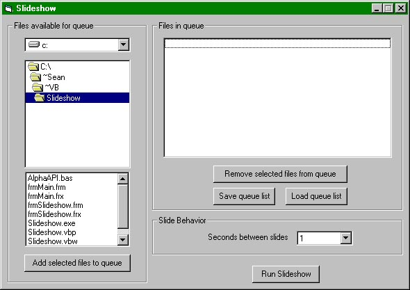



## A Basic, Alpha Blending, Picture Slideshow

### Description

This is a great example of how to resize images into pictureboxes, queue any number of images in the form of a slideshow, and alpha blend each consecutive images to create a fading effect between pictures. The program interface itself isn't designed to be attractive, but instead to teach the different aspects of the program -- you should find that the code is heavily commented. Any comments and votes would be extremely appreciated.
 
### More Info
 

             |
---                |---
**Submitted On**   |2005-07-03 14:21:34
**By**             |[Sean Patrick Kane](https://github.com/Planet-Source-Code/PSCIndex/blob/master/ByAuthor/sean-patrick-kane.md)
**Level**          |Intermediate
**User Rating**    |5.0 (25 globes from 5 users)
**Compatibility**  |VB 4\.0 \(32\-bit\), VB 5\.0, VB 6\.0
**Category**       |[Graphics](https://github.com/Planet-Source-Code/PSCIndex/blob/master/ByCategory/graphics__1-46.md)
**World**          |[Visual Basic](https://github.com/Planet-Source-Code/PSCIndex/blob/master/ByWorld/visual-basic.md)
**Archive File**   |[A\_basic\_\_a190866732005\.zip](https://github.com/Planet-Source-Code/sean-patrick-kane-a-basic-alpha-blending-picture-slideshow__1-61498/archive/master.zip)

